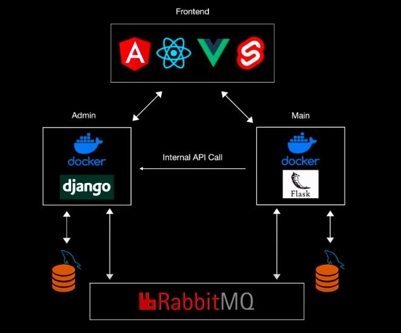

# Fully featured microservices architecture including:

## - django admin app and flask main app as services,

## - load-balancing nginx proxy,

## - cloud message queues,

## - automated deployment to digitalocean with circleCI,

## - containerization and bridging networks.

## Uses docker images instead of python virtual environemnts

# Step 1:

Create AMQPSCloud account and get URI string

# Step 2:

Setup environment variables. Docker-compose files pull for these files in development.

Create .env files in /admin/.env and /main/.env

ADMIN ENV

> cd admin
> vim .env

Add the following variables:

- AMQPS="<amqps_uri>"
- MYSQL_DATABASE="<db_name>"
- MYSQL_USER="<db_user>"
- MYSQL_PASSWORD="<db_userpass>"
- ALLOWED_HOSTS=<hosts_comma_separated>
- SECRET_KEY="<django_secret_key>"
- DEBUG=<1_for_dev_0_for_prod>

MAIN ENV

> cd main
> vim .env

Add the following variables:

- AMQPS="<amqps_uri>"
- MYSQL_DATABASE="<db_name>"
- MYSQL_USER="<db_user>"
- MYSQL_PASSWORD="<db_userpass>"
- ALLOWED_HOSTS=<hosts_comma_separated>
- SECRET_KEY="<flask_secret_key>"
- DEBUG=<1_for_dev_0_for_prod>

# Step 4:

Install Docker if haven't already done so.
Check installation by running following command in terminal:

> docker --version

-----Run Docker Containers-----

Admin App Container:

> cd admin/
> docker-compose up -d --build

Main App Container

> cd main/
> docker-compose up -d --build
